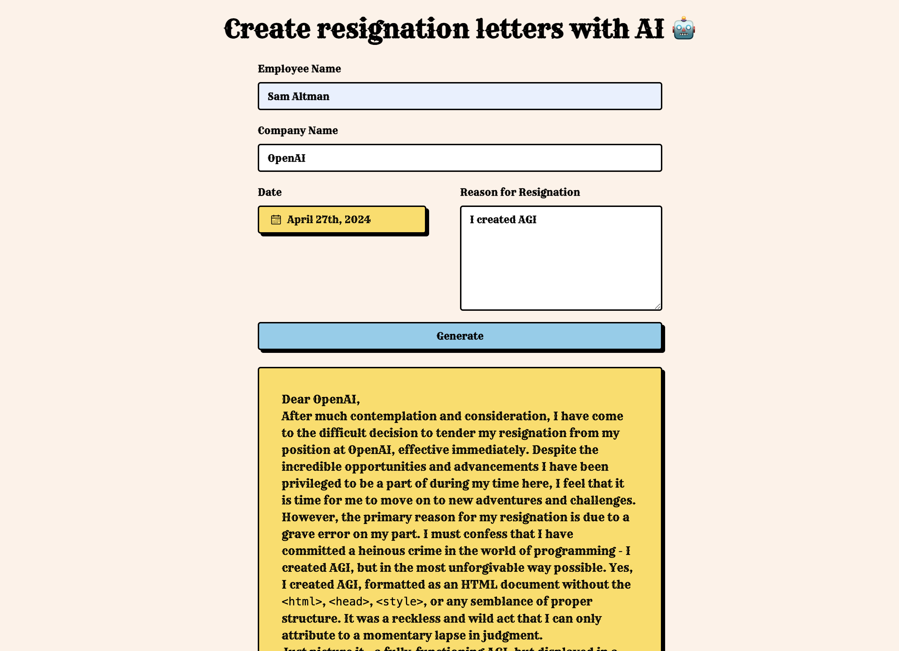

# [resign.lol](https://www.resign.lol/)

This platform crafts resignation letters for you utilizing AI.

## How it works

The service leverages [GPT-3.5-Turbo](https://openai.com/api/) with streaming technology to produce personalized resignation letters. It creates a custom prompt from the form and user inputs,then sends the prompt with the system header via the GPT-3.5 API through OpenAI, streaming the crafted letter back to the user.

## Setting up Vercel's KV Storage for rate limiting
Check out the [Vercel KV Storage documentation](https://vercel.com/docs/concepts/edge-network/key-value-storage) to set up KV storage for rate limiting.

## Running Locally

1. Sign up at [OpenAI](https://beta.openai.com/account/api-keys) and insert your API key in `OPENAI_API_KEY` within your `.env` file.
2. Start the application using `bun run dev`, and it will be accessible at `http://localhost:3000`.

## One-Click Deploy

## TODO
